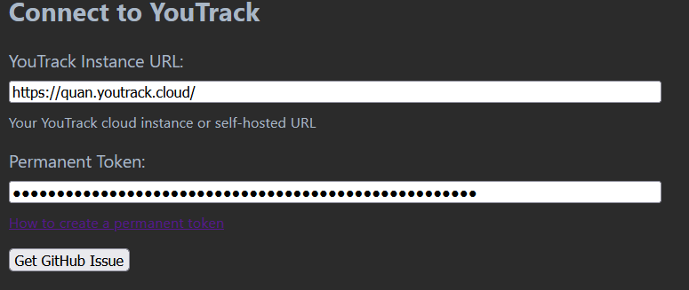
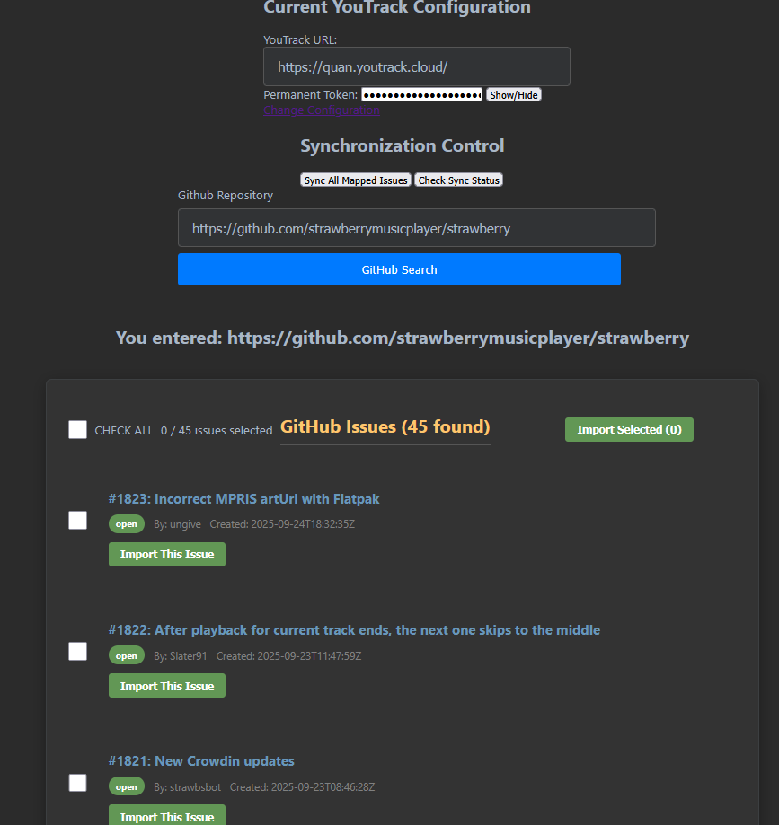
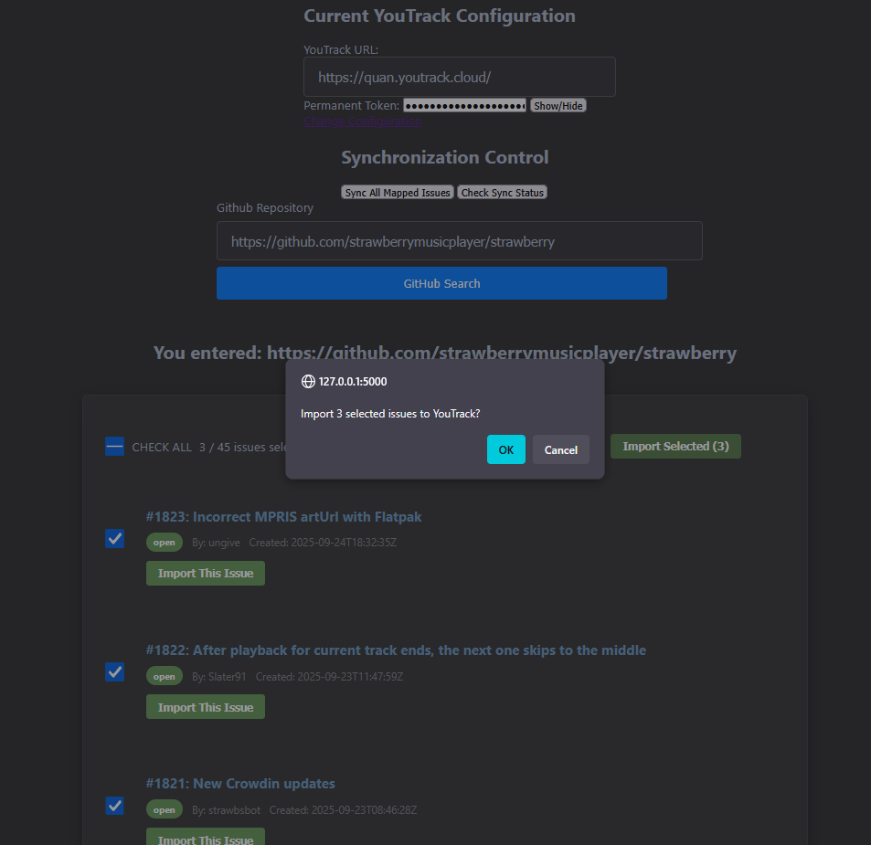
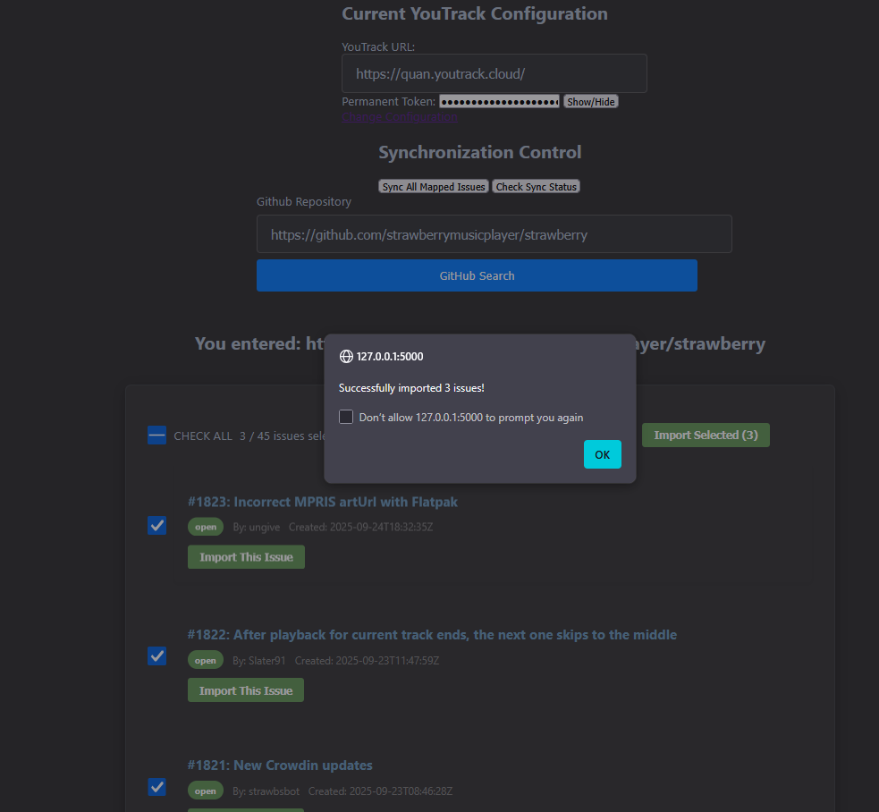
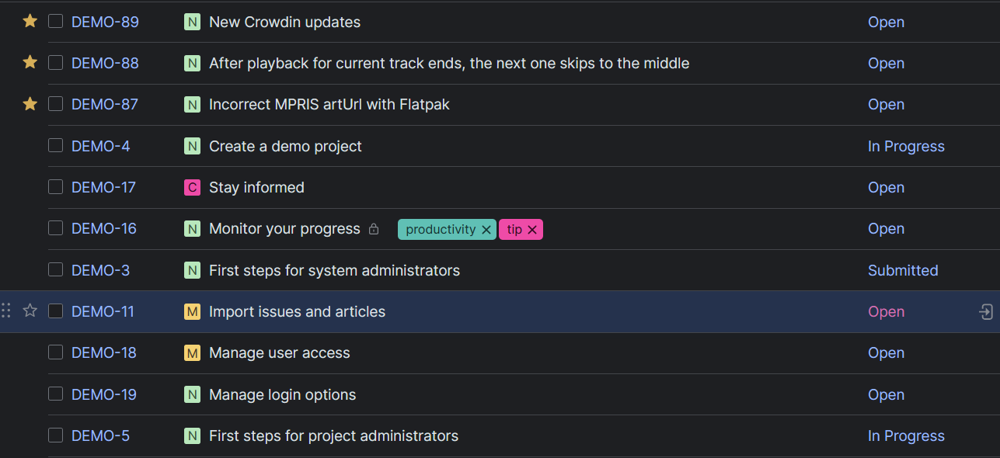
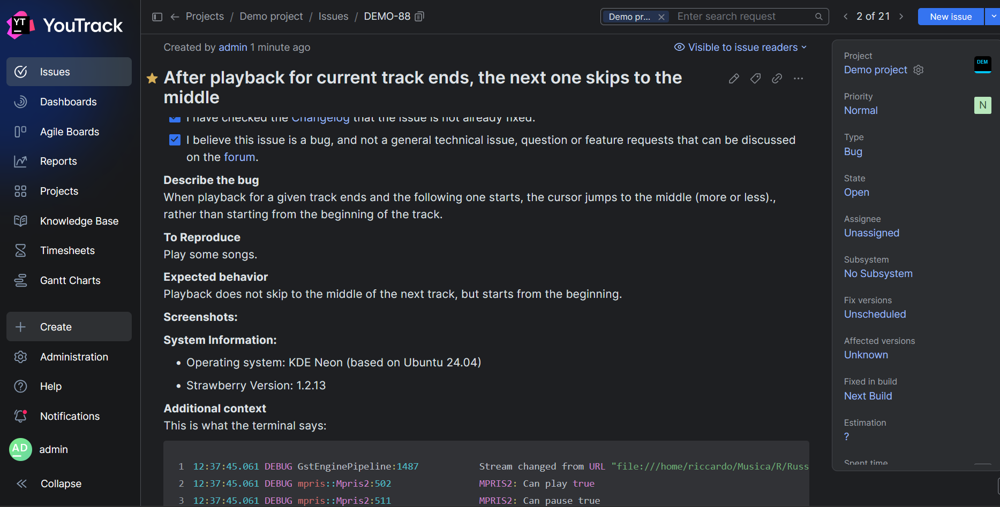
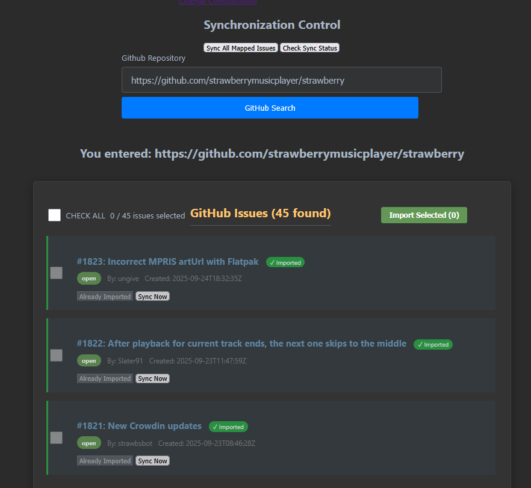
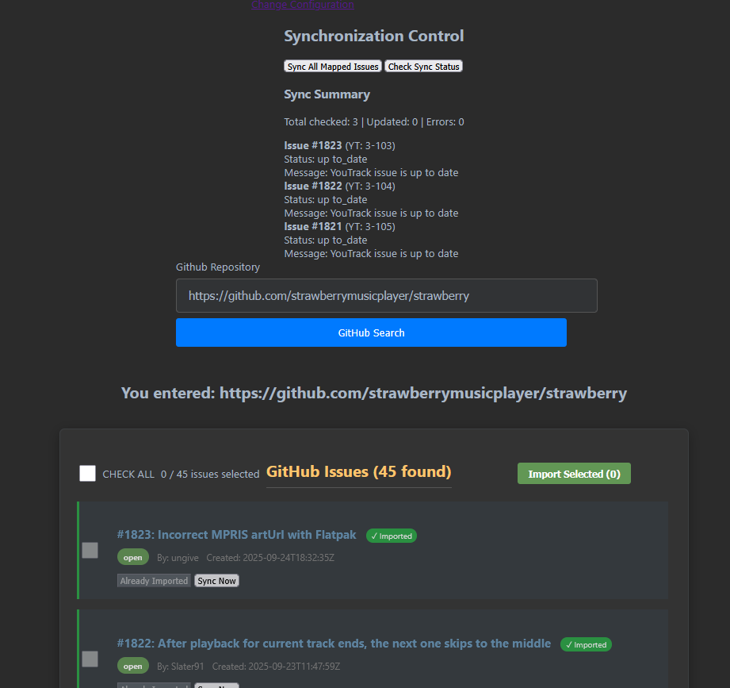

# GitHub Issues → YouTrack Importer

This project allows you to fetch **open issues from a GitHub repository** and import them into **YouTrack** as tasks using the YouTrack REST API.

---

## Quickstart

- Clone the repo

### Windows

- Run `.\start.bat`

### Linux, macOS

- Run `chmod +x start.sh`
- Run `./start.sh`

## Usage

- Generate a YouTrack permanent token following JetBrains’ guide:
  [Authentication with Permanent Token](https://www.jetbrains.com/help/youtrack/devportal/Manage-Permanent-Token.html)

- Save the token to a text file (e.g. youtrack_token.txt).
  The application will prompt you to provide this token when needed.

- Run the app and follow the prompts to import GitHub issues into YouTrack.

## Development

### Windows:

- `python -m venv .venv`
- `.\.venv\Scripts\Activate.ps1`

### macOS/Linux:

- `python3 -m venv .venv`
- `source .venv/bin/activate`

- Install dependencies: `pip install -r requirements.txt`

- Start the server: `python src/app.py`

## Showcase

- Authenticating with YouTrack
  
- Successful GitHub repository search
  
- Selecting 3 issues and importing them leads to this prompt
  
- Successful issue import
  
- Logging into YouTrack, the 3 issues have been imported (newly starred ones)
  
- Title, description, status and state have been imported
  
- Imported issues are colored green
  
- Use `Check Sync Status` to see if the issues are updated on GitHub. Use `Sync All Mapped Issues` to push new issues to Youtrack
  
